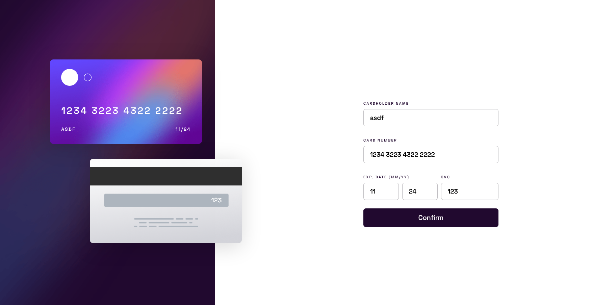

# Frontend Mentor - Interactive card details form solution

This is a solution to the [Interactive card details form challenge on Frontend Mentor](https://www.frontendmentor.io/challenges/interactive-card-details-form-XpS8cKZDWw). Frontend Mentor challenges help you improve your coding skills by building realistic projects.

## Table of contents

- [Overview](#overview)
  - [The challenge](#the-challenge)
  - [Screenshot](#screenshot)
  - [Links](#links)
- [My process](#my-process)
  - [Built with](#built-with)
  - [What I learned](#what-i-learned)
  - [Continued development](#continued-development)
- [Author](#author)

## Overview

### The challenge

Users should be able to:

- Fill in the form and see the card details update in real-time
- Receive error messages when the form is submitted if:
  - Any input field is empty
  - The card number, expiry date, or CVC fields are in the wrong format
- View the optimal layout depending on their device's screen size
- See hover, active, and focus states for interactive elements on the page

### Screenshot



### Links

- Solution URL: [https://github.com/clickers331/fementor-interactive-card-details-form-main](https://github.com/clickers331/fementor-interactive-card-details-form-main)
- Live Site URL: [https://clickers331.github.io/fementor-interactive-card-details](https://clickers331.github.io/fementor-interactive-card-details)

## My process

### Built with

- Semantic HTML5 markup
- CSS custom properties
- Flexbox
- CSS Grid
- Mobile-first workflow
- Javascript

### What I learned

I learned quite a bit with this project. I learned how to work mobile-first with websites, refreshed my knowledge of regular expressions and surprisingly, I fiddled around with absolutely positioned elements and how to think responsively with them (can't believe I haven't done this before).

Especially in Javascript, I am really proud of my implementation of adding the event listeners to all of the inputs.

I basically created an object containing all of the card input elements and their display elements (ones that are on the actual card) where also they are paired together.

And I looped over this object and added event listeners to all of them. It might sound simple, that's because it really is. But this cut down the event listener logic from being 150 lines to 50 lines (including the object mentioned earlier)

```js
Object.keys(cardInputAndOutputs).forEach((key) => {
  const cardItem = cardInputAndOutputs[key];
  const { input, display } = cardItem;

  input.addEventListener("keyup", (e) => {
    updateCardElement(display, input.value);
    if (typeof cardItem.extraFunctionKeyup === "function")
      cardItem.extraFunctionKeyup(e);
  });
  input.addEventListener("blur", () => {
    updateCardElement(display, input.value);
    if (typeof cardItem.extraFunctionBlur === "function")
      cardItem.extraFunctionBlur(e);
  });
});
```

### Continued development

I want to focus more on interactivity and mobile design.

## Author

- Website - [Tarik Kaya](https://clickers331.github.io/portfolio/)
- Frontend Mentor - [@clickers331](https://www.frontendmentor.io/profile/clickers331)
